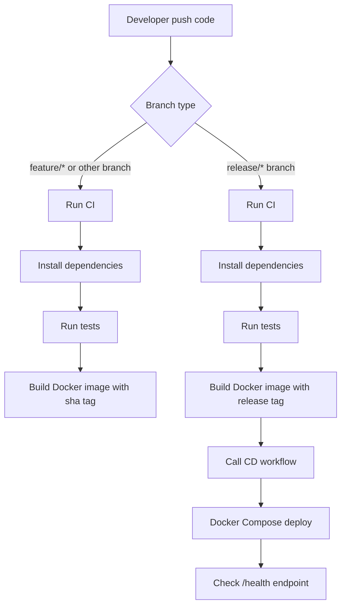
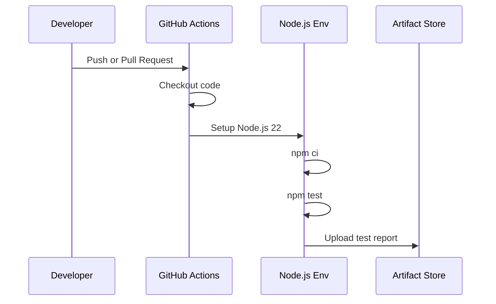
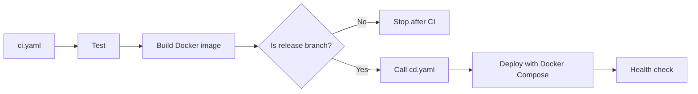

# CI/CD Lab 課堂練習說明

## 1. 作業目標

這份文件先說明 Lab 01 到 Lab 04 的課堂練習內容。這些 lab 是為了讓我們先把 GitHub Actions、CI、CD、Docker image tag 與 release branch deployment 的基本流程跑通；PDF 作業內容應該在 lab 完成後，再根據 PDF 額外要求繼續實作。

專案本身是一個使用 Fastify 的 Node.js 服務。Lab 的目標是透過 GitHub Actions 建立自動化流程，觀察程式碼在不同分支被 push 後，CI 與 CD 會如何執行。

主要學習重點包含：

1. 建立 GitHub Actions workflow。
2. 在 push 或 pull request 時自動執行 CI。
3. 自動安裝依賴、執行測試、產生測試報告 artifact。
4. 使用 `act` 在本機模擬 GitHub Actions。
5. 根據 branch 類型產生不同 Docker image tag。
6. 在 release branch 觸發 CD 流程，使用 Docker Compose 部署並檢查服務健康狀態。

## 2. 我做了什麼

我先把 repo 裡 `snippets/` 提供的四個 workflow 放到 `.github/workflows/` 底下，讓 GitHub Actions 可以真正執行它們：

| 檔案 | 目的 |
|---|---|
| `01_hello.yaml` | 驗證 GitHub Actions 能被 push 事件觸發，並輸出基本訊息。 |
| `02_run-test.yaml` | 安裝 Node.js 依賴、執行測試，並上傳測試報告 artifact。 |
| `ci.yaml` | 建立正式 CI pipeline，支援 Node.js 22 與 24，並依 branch 產生 Docker image tag。 |
| `cd.yaml` | 建立可被 `ci.yaml` 呼叫的 CD workflow，在 release branch 上部署並驗證健康檢查。 |

這樣做的原因是 GitHub Actions 只會自動讀取 `.github/workflows/` 底下的 workflow 檔案。原本 `snippets/` 只是範例檔，必須放到 `.github/workflows/` 才會真正被 GitHub Actions 執行。

此外，`snippets/ci.yaml` 原本保留了一段課堂練習用的 TODO：

```yaml
# add your steps here, e.g. lint, test, build etc.
```

這一段也已經補完，讓 Lab 04 的 CI pipeline 不只是建 Docker image，而是會先完成程式品質檢查。

## 3. 整體流程圖



## 4. 各 Lab 內容說明

### Lab 01: Hello GitHub Actions

這一部分的目標是確認 GitHub Actions 真的會在 push 後自動執行。

`01_hello.yaml` 做的事情很簡單：

1. 在任意 branch push 時觸發。
2. checkout repo 程式碼。
3. 印出 `Hello World!`。
4. 顯示目前目錄內容。

這個 workflow 的重點不是測試程式，而是確認 Actions 環境和 workflow 觸發條件正常。

### Lab 02: Run Tests

這一部分開始進入正式 CI 的概念。

`02_run-test.yaml` 會：

1. 在 push 或 pull request 時觸發。
2. 安裝 Node.js 22。
3. 執行 `npm ci` 安裝相依套件。
4. 執行測試。
5. 產生 JUnit 格式測試報告。
6. 使用 `actions/upload-artifact` 上傳測試報告。

測試報告 artifact 的用途是讓我們即使 workflow 失敗，也能下載測試結果來分析原因。



### Lab 03: Run GitHub Actions with act locally

這一部分是在本機用 `act` 模擬 GitHub Actions。

作業要我們理解：不一定每次都要 push 到 GitHub 才能測 workflow。使用 `act push` 可以在本機模擬 push event，快速檢查 workflow 是否能跑。

常用指令：

```bash
act push
```

只跑單一 workflow：

```bash
act push -W .github/workflows/ci.yaml
```

這在除錯 CI 設定時很有用，因為可以減少 push 後等待 GitHub Actions 的時間。

### Lab 04: Conditional workflow and deploying

這一部分是作業中最接近真實 CI/CD 的部分。

`ci.yaml` 會先執行完整 CI 檢查：

1. `npm run format:check`
2. `npm run lint`
3. `npm run typecheck`
4. `npm test`
5. `npm run build`

通過後，再根據 branch 決定 image tag：

| Branch | Image tag 規則 |
|---|---|
| `feature/*` 或一般 branch | `sha-<commit 前 7 碼>` |
| `release/*` | `release-<版本號>` |

例如：

| Branch | 產生的 image tag |
|---|---|
| `feature/a` | `sha-a1b2c3d` |
| `release/1.0.0` | `release-1.0.0` |

這樣設計的原因是 feature branch 通常用 commit SHA 追蹤來源，而 release branch 需要清楚對應版本號。

## 5. CI 與 CD 的關係

CI 負責確認程式碼品質，例如安裝依賴、測試、建置 image。CD 則負責把已確認的版本部署到目標環境。

在這份作業中，`ci.yaml` 是主要入口：



這個設計可以避免每個 feature branch 都自動部署。只有 `release/*` branch 才會進入 CD，這比較符合真實專案的部署流程。

## 6. 為什麼要加入這四個 workflow

這四個 workflow 對應作業要求的四個階段：

1. `01_hello.yaml` 用來驗證 GitHub Actions 基本觸發。
2. `02_run-test.yaml` 用來練習測試與 artifact。
3. `ci.yaml` 用來建立完整 CI pipeline。
4. `cd.yaml` 用來建立 release branch 才會啟動的部署流程。

如果只加入 `ci.yaml` 和 `cd.yaml`，最後的 CI/CD 可以運作，但 Lab 01 和 Lab 02 的觀察要求會少掉。因此我保留四個 workflow，讓每個 lab 都能在 Actions 頁面看到對應的執行結果。

原本 `ci.yaml` 中留給學生補的品質檢查步驟，也屬於 Lab 04 要完成的內容，所以這次已經補上。這樣 Lab 01 到 Lab 04 才算是先完成，後續再開始處理 PDF 的正式作業要求。

## 7. 預期觀察結果

在 feature branch push 後，應該可以看到：

1. `Hello GitHub Actions` workflow 執行。
2. `Run Tests` workflow 執行。
3. `ci` workflow 執行。
4. Docker image tag 類似 `sha-xxxxxxx`。
5. `cd` 不會部署，因為不是 release branch。

在 `release/1.0.0` branch push 後，應該可以看到：

1. `ci` workflow 執行。
2. Docker image tag 變成 `release-1.0.0`。
3. `ci.yaml` 呼叫 `cd.yaml`。
4. Docker Compose 啟動服務。
5. workflow 檢查 `http://localhost:3000/health`。

## 8. 總結

Lab 的核心不是只把 YAML 放上去，而是理解「程式碼進入 repo 後，如何自動被測試、建置、標記版本，並在 release branch 上部署」。

我這樣安排 workflow，是為了先完整對應 Lab 01 到 Lab 04，並讓 Actions 頁面能清楚看到每個階段的執行結果。Lab 完成後，下一步才是閱讀 PDF 的正式作業要求，判斷還需要新增哪些 CI/CD 設計、截圖、報告或實作內容。
